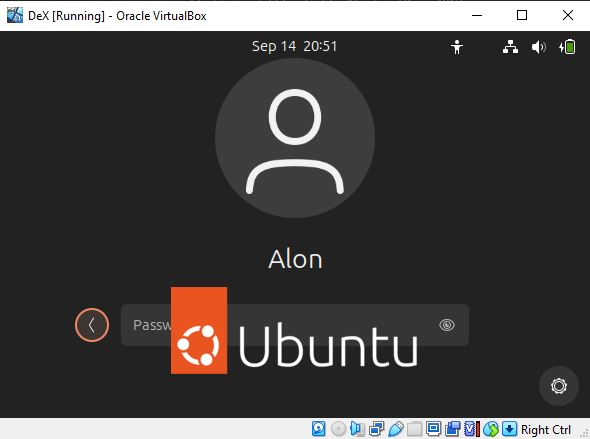
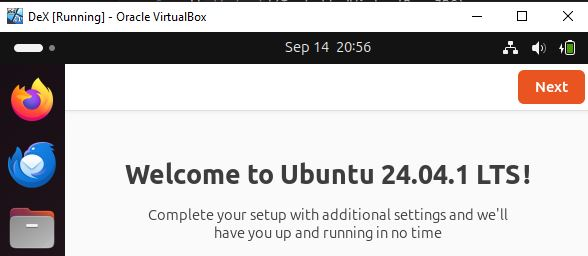
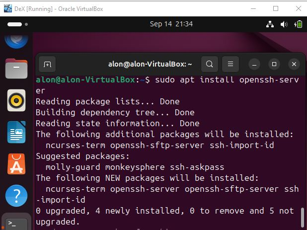
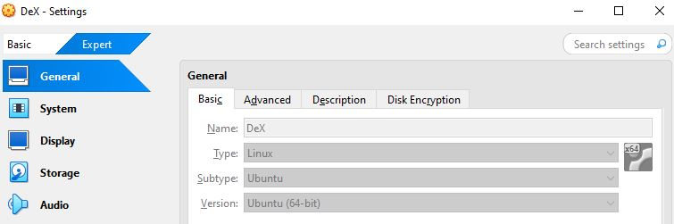
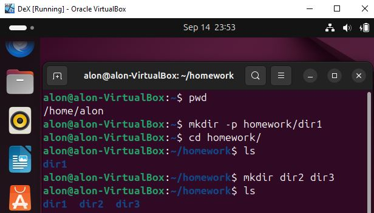
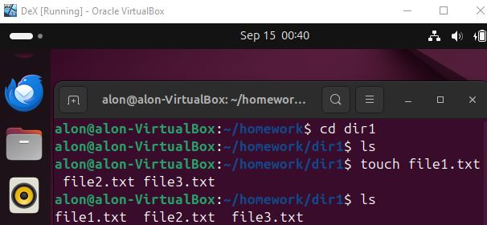
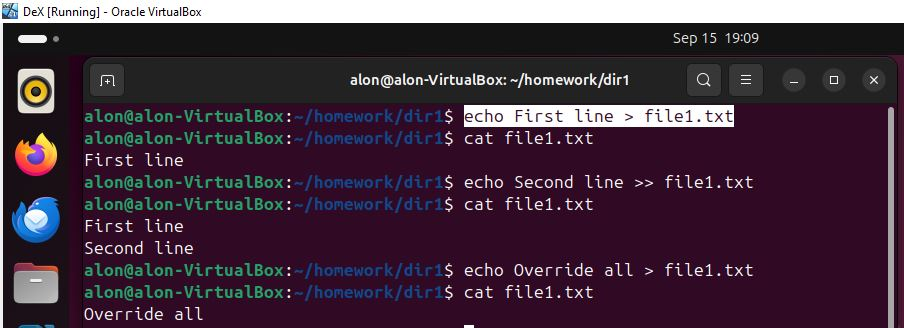
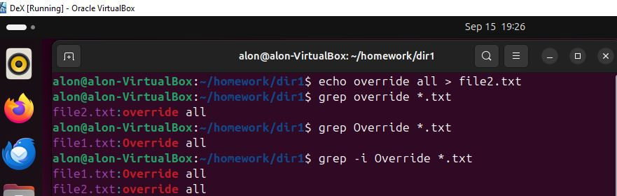
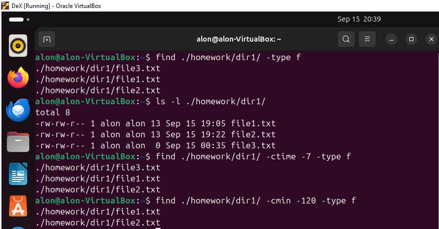

# DeX

Part 1:  
  
VirtualBox after installing:  
  
  
After installing Ubuntu Desktop 24.04.1 LTS on VirtualBox:  
  
  
After installation I used:  
audo apt update  
sudo apt upgrade  

Because I didn't have an ssh server installed by default I also used:  
sudo apt install openssh-server  
  

Fixed (just before the last screenshot) the OS Type + Subtype + Version.    

Also installed and activated virtualbox-guest-x11(for shared clipboard) based on:  
https://superuser.com/questions/1318231/why-doesnt-clipboard-sharing-work-with-ubuntu-18-04-lts-inside-virtualbox-5-1-2  
  
Part 2:  
  
Create directory structure:
  
Commands:
1. pwd  
2. mkdir -p homework/dir1  
3. cd homework  
4. mkdir dir2 dir3  
  

  
Explanations:  
1. Show the current directory.
2. Added the homework and homework/dir1 together with the -p parameter(to create parent directories when needed).  
3. Got into the homework directory,  
4. Added dir2 and dir3 by one mkdir command.  
  
Create files:

Commands:  
1. cd dir1  
2. touch file1.txt file2.txt file3.txt.  

Explanations:
1. Got into the dir1 directory.
2. Created all the files by one touch command.  
(Also used ls to list the files).

Add content to files:

Commands:  
1. echo First line > file1.txt  
2. echo Second line >> file1.txt  
3. echo Override all > file1.txt  

Explanations:  
1. Added the first line by the overriding redirection operator(but overriding an empty file).  
2. Added the second line by the appending redirection operator.    
3. Overrided the content by the overriding redirection operator.  

Part 3:

Search for text within files:  

Commands:  
1. echo override all > file2.txt  
2. grep override *.txt  
3. grep Override *.txt  
4. grep -i Override *.txt  
  
  
  
Explanations:
1. Added content with override with lowercase to file2.txt.  
2. Used grep to search for "override"(Case sensitive) within *.txt.  
3. Used grep to search for "Override"(Case sensitive) within *.txt.  
4. Used grep to search for "override"(Case insensitive) within *.txt.  

Find command:  
  
(Did it after fixing the guest type - added screenshot in part 1)  
  
Commands:  
1. find ./homework/dir1/ -type f  
2. ls -l ./homework/dir1/  
3. find ./homework/dir1/ -ctime -7 -type f  
4. find ./homework/dir1/ -cmin -120 -type f  
  
  
  
Explanations:  
1. Found all the files(only files) in relative directory(from home) ./homework/dir1/ .  
2. Listed files in this directory with dates for the next commands.  
3. Found files in this directory - modified within the last 7 days(All of them).  
4. Found files in this directory - modified within the last 120 minutes(Just 2 of them).  
  
(Didn't really need the "./" in those commands).