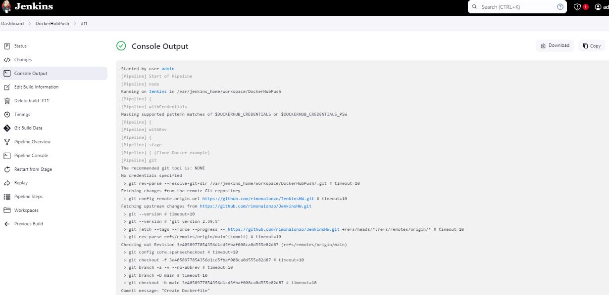
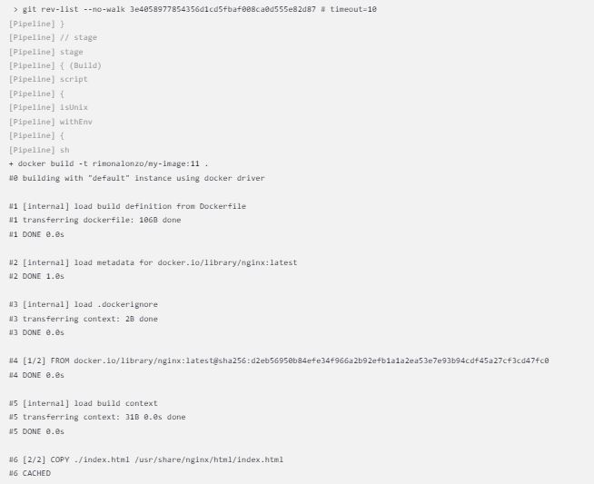
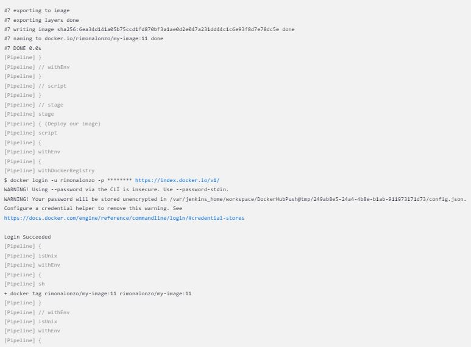
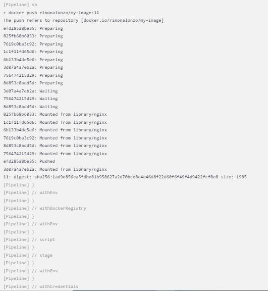
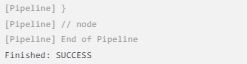
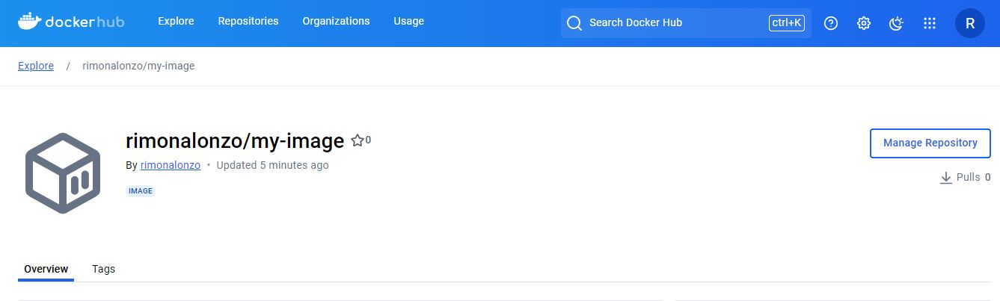

Jenkins successful build screenshots:

DockerHub link:
https://hub.docker.com/r/rimonalonzo/my-image

DockerHub Screenshot:

In the real world, I'll take care that the docker hub credentials won't be stored unencrypted.