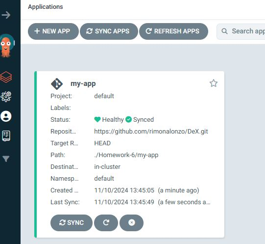
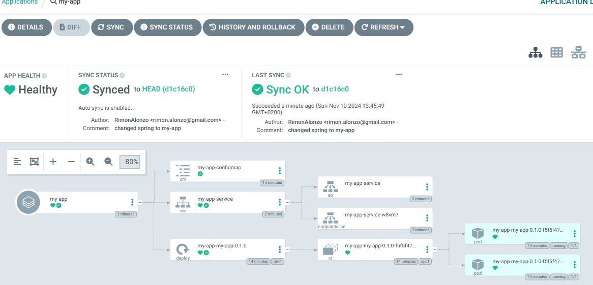

I assumed 2 pods meaning was 2 replicas.  
  
used this command:  
kubectl apply -f argocdproj.yaml -n argocd  
  
and got this output:  
application.argoproj.io/my-app created  
  
After applying the yaml:  

Apps overview screenshot:  
  

My-app details screenshot:  
  

(I used docker desktop and minikube with docker driver - all in windows)